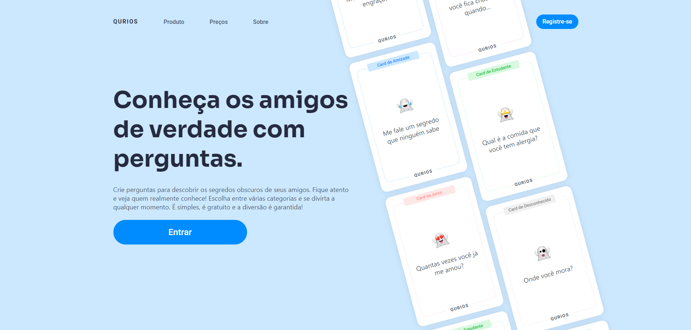

<div align="center">
  
</div>

<h1 align="center" style="display: flex; align-items: center; justify-content: center; gap: 1rem;">Qurios - Backend</h1>

<h4 align="center">
  Crie perguntas para descobrir os segredos obscuros de seus amigos. Fique atento e veja quem realmente conhece! Escolha entre várias categorias e se divirta a qualquer momento.
</h4>

<p align="center">
  <a href="#-tecnologias">Tecnologias</a>&nbsp;&nbsp;&nbsp;|&nbsp;&nbsp;&nbsp;
  <a href="#-como-executar">Como executar</a>&nbsp;&nbsp;&nbsp;
</p>

## 👨‍💻 Projeto

O projeto utiliza Fastify e Node para desenvolvimento. Oferece autenticação JWT para usuários, permitindo a criação, edição e exclusão de perguntas.

Ele foi dividido em client e server. O servidor está hospedado na [render](render.com). Utiliza o banco de dados PostgreSQL hospedado no [Neon](neon.tech).

Os testes foram desenvolvidos utilizando o Vitest e o GitHub Actions para testar a cada PR os testes E2E e a cada push os testes unitários

## 🧪 Tecnologias

Foram usadas as seguintes tecnologias:

- **Node.js** >=18 (especificado na seção engines)
- **Fastify:** Framework web utilizado
- **Fastify plugins:**
  - `@fastify/cors`
  - `@fastify/jwt`
- **Bibliotecas de Validação de Dados:**
  - `zod`
- **Ferramentas de Teste:**
  - `supertest` (para testes de API)
  - `vitest` (framework de teste)
- **Ferramentas de Desenvolvimento:**
  - `tsup` (para compilação de TypeScript)
  - `typescript`
  - `eslint` (ferramenta para linting de código)
  - `husky` (utilizado para githooks)
  - `commitlint` (para manter as mensagens de commit padronizadas)
  - `dotenv` (para carregar variáveis de ambiente)
  - `prisma` (utilizado para interação com o banco de dados)

## 🧑‍🔧 Funcionalidades

Algumas das funcionalidades

1. Autenticação JWT no backend para acesso.
2. CRUD (Create, Read, Update, Delete) disponível para perguntas dos usuários.
3. Resposta às perguntas de outros usuários permitida.
4. Usuários podem criar perfis.
5. Usuários podem criar perguntas com categorias: Amizade, Amor, Estudante, Desconhecido e Família.

## 🚀 Como executar

Faça um clone do projeto e acesse a pasta criada.

```
git clone https://github.com/fabriciolak/qurios-backend.git
```

```
cd qurios-backend
```

Para iniciá-lo, siga os passos abaixo:

### Tem o docker instalado?

Utilizando o docker, é possível obter uma imagem do postgresql para utilizar no modo de desenvolvimento. Para isso, é necessário ter a versão mais recente do Docker instalada e o docker compose.

Lembre-se de configurar as variáveis de ambiente corretamente. Veja no [.env.example](https://github.com/fabriciolak/qurios-backend/blob/main/.env.example)

## 👾 Instalar as dependências

Aliases: `i`

```
  npm install
```

## 😎 Iniciar o projeto

```
  npm run dev
```

## 😎 Rodar os tests

O comando abaixo irá executar os serviços necessários para rodar os testes.

```
  # Terminal 1
  npm run dev

  # Terminal 2
  npm run test
```

Caso prefira manter os testes rodando no modo de desenvolvimento (rodando a cada alteração), use o comando abaixo:

```
  npm run test:watch
```

<h1 align="center">
  <a href="https://www.github.com/fabriciolak">
    
  </a>
</h1>
